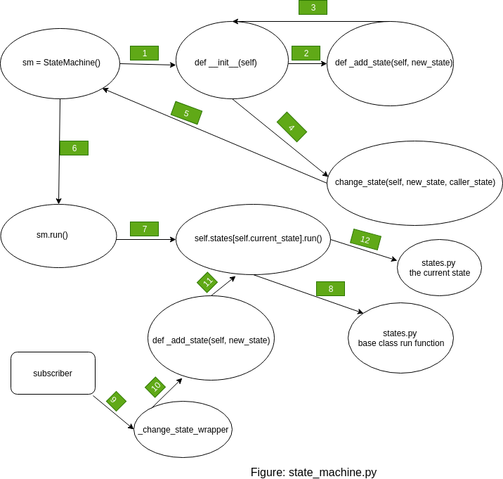

# Quadrotor
The description of this repository is following:  
**multi_quadrotors**: bash scripts launch multiple quadrotrs in in Gazebo platform.  
**single_quadrotors**: bash scripts launch single quadrotors in the Gazebo platform.  
**python_scripts**: It has two files (1) state_machine.py (2) states.py   
(1) **state_machine.py**: The idea of the state machine is to control all states, add new states and update current states. The code works following way:   
[note: -> program propagation] 

(i) Program starts from sm = StateMachine(): First creating StateMachine instance ->  def __init__(self): the constructor of the class is being initialized here.    

(ii) -> **def __init__(self)**: first it is creating instance of  the publisher class cmd_vel_topic which will publish a string,ROS msg. The program also creates an instance of subscriber class change_state_topic which is subscribing to ROS topic "change_state".   

(iii) In the for loop, the program is iterating through states.py, getmembers add all the states as a list.  The for loop iterate through the list of classes, and call the add_state() function with class name as argument.   

(iv) -> **def _add_state(self, new_state)**:  in this function the program is adding the new state/class. First the function is checking whether new_state in the dictionary or not. If not in the dictionary, first define the instance. Inside the try block if condition is checking the instnaces.next is callable, if it is then initialize the instance of the class. Inside this if block the function also publishing ROS msg in the topic "cmd_vel_topic".   

(v) -> the program then goes back to for loop do the same as steps 1 and steps 2. Once it’s done with adding all the states/class in the list, the program run this **self.change_state('GroundedState', '')**.   

(vi)-> with 'GroundedState' as argument, initially the change state is updating the current state as **'GroundedState'**.  

(vii) -> sm.run() will run the current state **self.states[self.current_state].run()** which is running the base class run function for the first time, preassumbly, initially the program is considering the ground to be run first which is calling the base class run() function. Inside the bases class,  **def run(self):   self.cmd_vel.publish(self.msg)**  is publishing the default parameter of the Twistamped message (0,0,0).  -> after this initial initialization process, if subscriber node subscribes to a topic with new state, **_change_state_wrapper** will be called with the ROS message from the topic. **_change_state_wrapper**  calls the change_state function with old state and new state as a parameter. Change state adds new state if it does not exist, then update the current state. Sm.run will run with new current state class. 

(2) **states.py**: has the descriptions of the states.   

**initial_scripts**: is showing the intial approach which was not efficient. 

